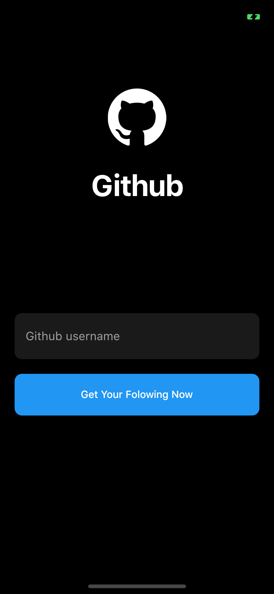
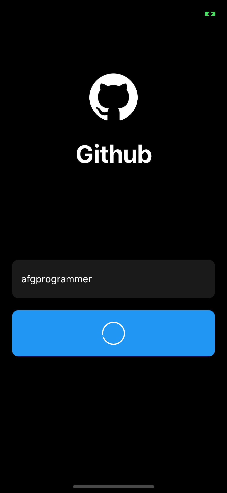
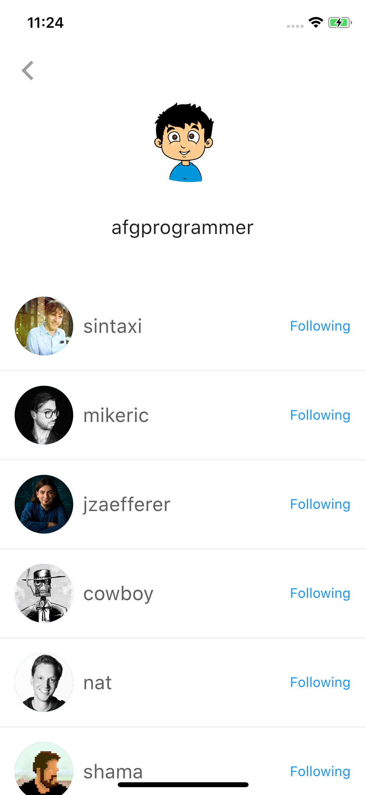

## Flutter Github Following Application 

### [Watch it on Youtube](https://youtu.be/VHYvpTwpW-Q)


## Previous Designs
[Checkout my Youtube channel](https://youtube.com/afgprogrammer)


# Installation
Please remember, after cloning this repository, you should edit GithubRequest.dart file and put your client_id and client_secret.

## Development Setup
Clone the repository and run the following commands:
```
flutter pub get
flutter run
```

## Screenshots



## Links

* [Website](https://afgprogrammer.com)
* [Youtube channel](https://youtube.com/afgprogrammer)
* [Twitter](https://twitter.com/afgprogrammer)
* [Instagram](https://instagram.com/afgprogrammer)
